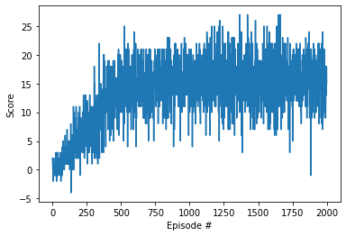

## Learning Algorithm

Since the environment of this Navigation has a continuous state space, Deep Q-Network model was used to train a model, and Experience Replay was also applied to remove correlations.

#### Neural Network

- Input Layer: 37 nodes
- Hidden Layer-1: 64 nodes (RELU)
- HIdden Layer-2: 64 nodes (RELU)
- Output Layer: 4 nodes
- Optimizer: Adam

#### Hyper Parameters

```
BUFFER_SIZE = int(1e5)  # replay buffer size
BATCH_SIZE = 64         # minibatch size
GAMMA = 0.99            # discount factor
TAU = 1e-3              # for soft update of target parameters
LR = 5e-4               # learning rate 
UPDATE_EVERY = 4        # how often to update the network
```

## Plot of Rewards

```
Episode 100	Average Score: 1.07
Episode 200	Average Score: 4.27
Episode 300	Average Score: 6.89
Episode 400	Average Score: 10.03
Episode 500	Average Score: 12.98
Episode 600	Average Score: 14.83
Episode 700	Average Score: 15.09
Episode 800	Average Score: 15.25
Episode 900	Average Score: 15.48
Episode 1000	Average Score: 16.11
Episode 1100	Average Score: 15.44
Episode 1200	Average Score: 16.24
Episode 1300	Average Score: 16.39
Episode 1400	Average Score: 15.87
Episode 1500	Average Score: 15.72
Episode 1600	Average Score: 16.06
Episode 1700	Average Score: 15.77
Episode 1800	Average Score: 15.93
Episode 1900	Average Score: 15.76
Episode 2000	Average Score: 15.61
```



## Ideas for Future Work

For the future work, additional models can be used to this project: Double DQN, dueling DQN, etc. 